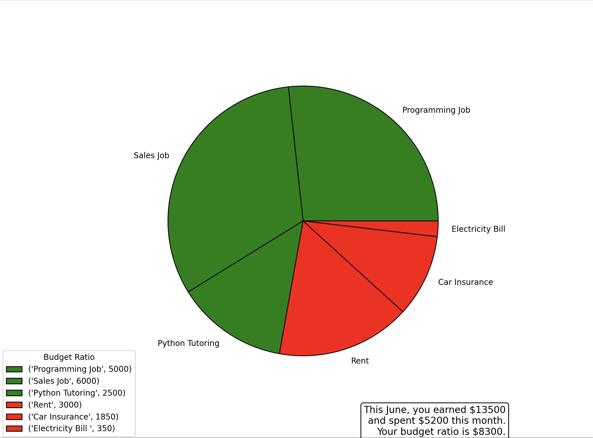

# SpendWise 

SpendWise is a simple and intuitive monthly budget tracking application that helps individuals manage their income and expenses. SpendWise provides visualization for users' budgets with an informative pie chart. It provides a convenient way to track finances, make informed spending decisions, and maintain a balanced budget.
